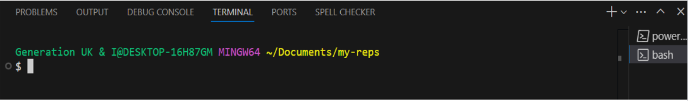
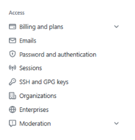
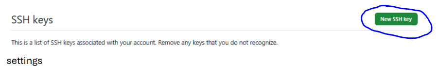
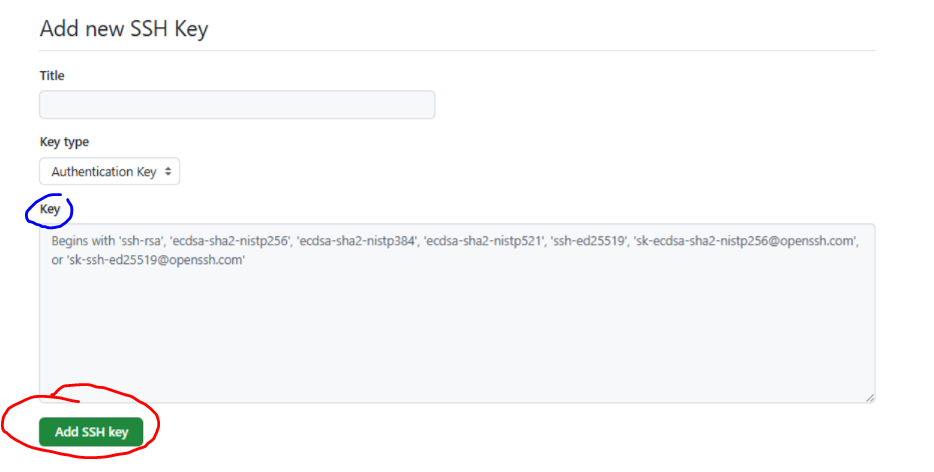

## Generating an SSH Key for Github Use

This section is optional. Sometimes HTTPS as a way to clone your repositories can not work, so there is another way to clone our repositories using SSH. 

While HTTPS is a common method for cloning repositories, sometimes it can be problematic due to authentication issues or network restrictions. In these cases, using SSH (Secure Shell) can be an alternative. 

SSH provides a secure and encrypted connection between two devices, through which they can communicate. One reason SSH remains very widely used is because it can secure various communication protocols between clients, servers, and in our ase our local machine and a remote repository. 

Once configured SSH allows you to clone, pull, and push changes without needing to enter your username and password each time. SSH keys come in matched pairs, each pair is unique and includes a public key, and a private key - which **should be kept secure**, therefore it also acts as your authentication credentials.

One of the major benefits of SSH is the convenience of key-based authentication, which is more secure and efficient than using HTTPS with a username and password which could be compromised or guessed. 

However, SSH does require you to generate a pair of SSH keys, which can be a bit complex for beginners.

HTTPS is easier to set up, and doesn't require generating keys, making it more straightforward, especially for new users. But HTTPS may still require you to enter credentials frequently unless you set up a credential manager. 

Ultimately, SSH is preferred for those who prioritize security and want to avoid repeatedly typing passwords, while HTTPS remains a simple and widely-used option for quick setups.

    It is worth noting that for public repositories, where you're making your source code freely available (such as for a portfolio), HTTPS is sufficient, since you don't need to authenticate every user.

Below there are some instructions to set-up SSH keys for working with your GitHub account so that you can push to your own repositories.

---

To generate your SSH keys enter the following commands in PowerShell, CMD, or a Git Bash terminal. *These environments can also be selected within your VSC Temrinal as seen below:*



1. Type the following to generate a pair of SSH keys, add the email address you use with your GitHub account (remove the square brackets):

```powershell
ssh-keygen -t ed25519 -C [your_email@example.com]
```
This command does the following:
- `ssh-keygen` = use the key generating utility  
- `-t ed25519` = `t` is to specifiy the type of key, in this case one that uses the `ed25519` encryption algorithm  
- `-C` = Add a comment, in this case your email address

2. To view both keys, use `ls ~/.ssh` to lists the contents of the `.ssh` directory in your home directory, which is where SSH-related files like keys and configurations are stored by default.

- `cat ~/.ssh/id_ed25519.pub `: The command `cat ~/.ssh/id_ed25519.pub` displays the contents of your public SSH key (`id_ed25519.pub`), which you can share with remote servers to authenticate your computer without needing a password.
``` powershell
cat ~/.ssh/id_ed25519.pub 
```

3. Copy the output from the `cat` command. You want to copy the entire line (do not copy the command itself). From the start of the line all the way to the end of your email (which should also display in this key). 

4. Switch back to GitHub and click on your profile circle:


5. Then click on settings (at the bottom):


6. A page with these options will display: 



7. Select `SSH and GPG Keys`, this will display what ssh keys you already have or be empty if you don’t have any. To add a new key click on the green `New SSH key` shown below: 



8. Then where it says `Key` paste in your new key. You want to include the entire line (including the part with your generation email!). Also, give your key a title, remember something meaningful such as `name generation device`. When the form is complete click on the green `Add SSH key` button (circled red):



Congrats! You have set up SSH Keys to connect your VSC and Github. You should be able to clone a repository into your VSC and push your work onto Github (use the SSH link rather than the HTTPS link to do this). 

If you have not created a repository yet, that is okay! Checkout the `setup-github` markdown file to see how to do this. 