## Setting Up Github
Next you will be interacting with Github - creating an account, creating a repository, then cloning this into your VSC.  

### Part 1: Creating a Github Account

Follow the steps to create a Github account: 

1. Navigate to Github ([click here](https://github.com/join)) and create an account. *Please use your Generation email for this!* 
2. Walk through the verification processes shown when working through Github. 
3. When you have completed this, go to VSC and type into the extensions tab ‘Github’. You will see a list of Github extensions. Please install the one that says ‘*Github Pull Requests*’ as shown below:

***You are now ready to create a repository on Github!***

### Part 2: Creating a Repository on Github

You will now create a repository on Github, then connect your Visual Studio Code to save your work. Follow the instructions below: 

1. Go to Github, you should see a dashboard similar to the screenshot below. Press the top right icon (circled in blue). 

**NOTE:** This icon is a way to navigate through your Github account! You will use the ‘Your Organizations’ and ‘Your Repositories’ pages the most on the course. The ‘Your Organizations’ tab (circled red below) will take you to any organizations you are apart of, eventually you will see your class organization here! 

2. For now, click on the ‘Your Repositories’ tab, circled below blue. 

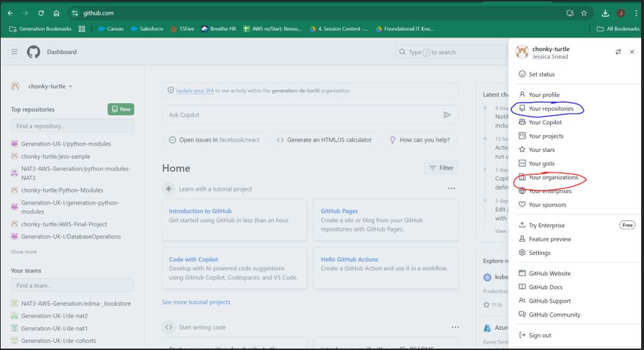

3. This area is where you can create and navigate to your personal repositories (a place where you can store some stuff, like your code!). Click on the 'New' repository button (circled red below):

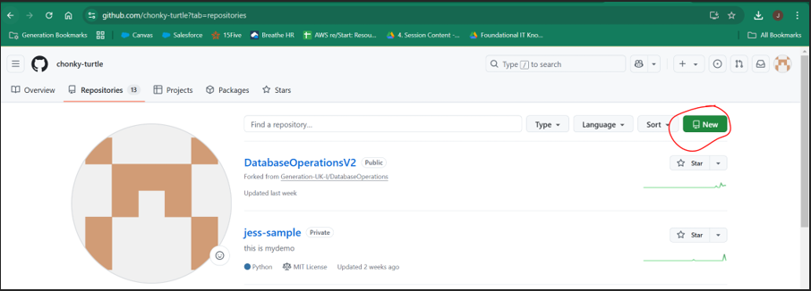

4. Next you will set-up your repository. You will do the following: 

- Set the name (make it meaningful)
- Add a description (What is this repo?)
- Set it to private 

Examples of where to put this information is shown in the screenshot below: 

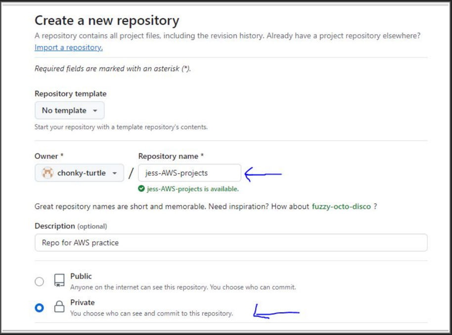

- Check the Add a README file option to initialise the repository with a README 
- Click the Create Repository button at the bottom of the screen (circled blue below)

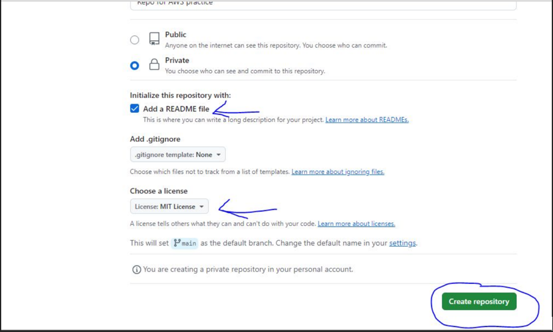

5. Wait for the repo to be created and displayed. You should see something like below: 

***Now it is time to connect our newly created repository to our Visual Studio Code!***

### Part 3: Connect your Repository to Visual Studio Code

Next you will connect your newly created repository on Github to your Visual Studio Code so you can persist your work and collaborate! Follow the instructions below to find out how: 

1. Start by going to your repository and clicking ‘code’. Navigate to the HTTPS tab and copy the link.

**NOTE:** If you need to use SSH, choose the SSH link instead at this point. 

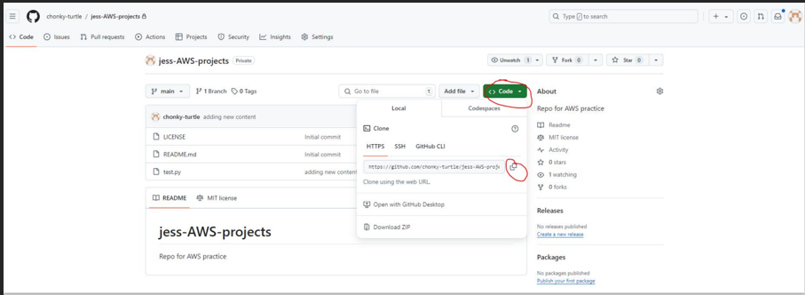

2. Navigate back to visual studio code. Make sure you are in your Python folder (the folder in the screenshot below is called ‘TEST’, but yours should be the python folder created in an earlier session). Click ‘Terminal’ then ‘New Terminal’. 

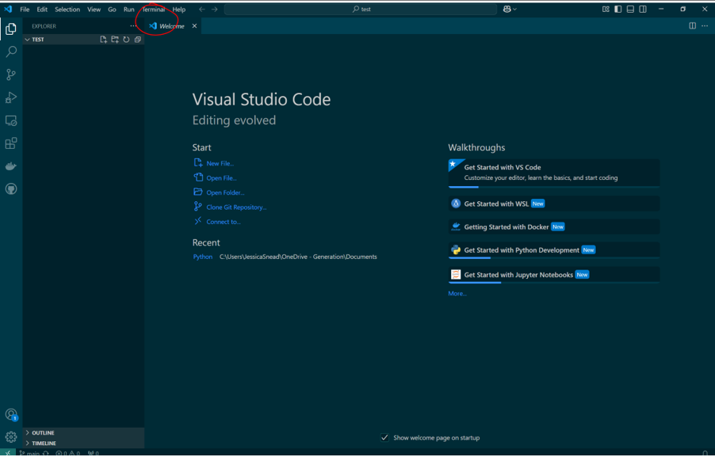

3. A new terminal will appear at the bottom of your page. Type in ‘git clone ‘ followed by the linked you copied from Github earlier (show underlined red below). Then press enter. 

**NOTE:** a pop up may appear asking your to confirm your identity for Github, follow the steps for this (in browser or other method specified on the pop-up). Something like below will show when your clone has been successful. You should also notice on the top left your repository name will show (blue arrow shown below).  

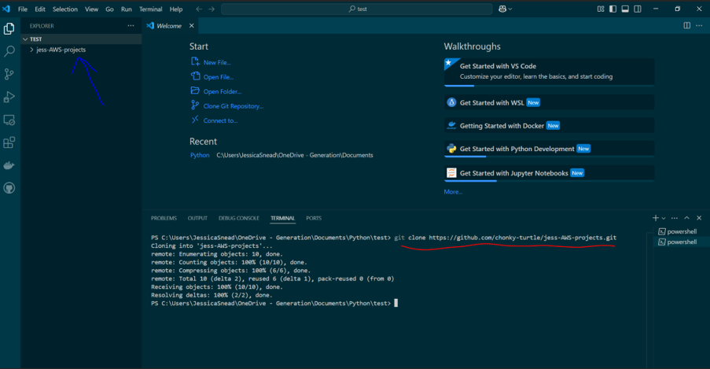

***Congrats! You have successfully cloned your repository into your Visual Studio Code! Next, let's put some code in it and store it on Github!***

### Part 4: Adding Some Code, Storing on Github

We will be adding some code to our Visual Studio Code, then pushing this to Github. Follow the instructions below to learn more: 

1. Start by right clicking your new repo (red line area shown below). Then click ‘Open in Integrated Terminal’. When you do this, you should see that your repository is shown in the  terminal’s path (blue arrow shown below). This is important, make sure you are always located in your repository if you want to push to your github. 

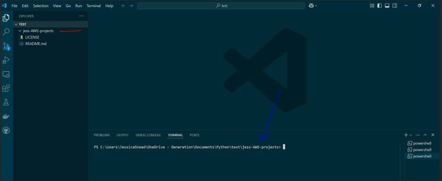

2. Next, click on your repository on the top left so it is highlighted. Then create a file (circled red below). The option to name your file will come up. Name it something like ‘test.py’ or ‘practice.py’, then press enter. 

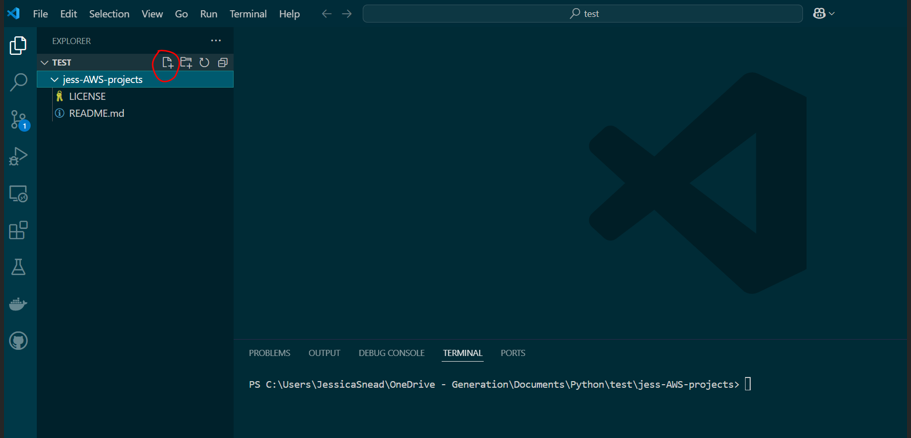

**NOTE:** If your file turns green, don't worry! That is normal and shows that Git is tracking your file. In Visual Studio Code, file colors indicate their status in Git:

- **Green**: A new file that has been added but not yet committed.  
- **Yellow/Orange**: A modified file that has been edited since the last commit.  
- **Red**: A file that was tracked before but has been deleted.  

These colors help you quickly see what changes you've made. Once you stage and commit your files, the colors will return to normal. You can check the file status in the Source Control tab (Ctrl + Shift + G or Cmd + Shift + G on Mac) or by using the command `git status` in your VSC terminal to see what’s happening in your Git workflow! Example of a green file color below: 

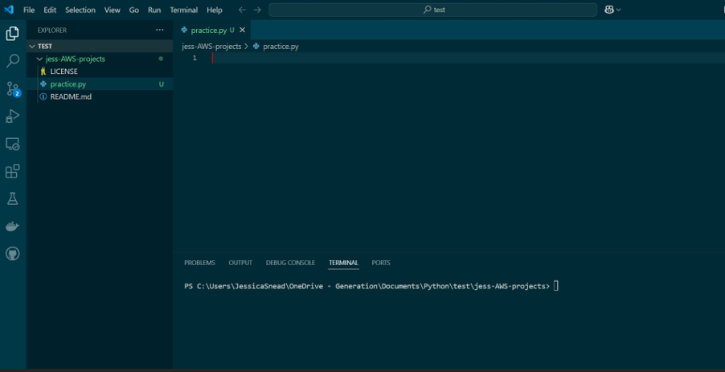

***Now for the fun part!***

3. In your new Python file, type something – **anything!** See an exmaple below: 

Now let’s push our new file onto Github. The commands you will need to do this is: 

- `git status`: Shows the current state of your working directory and staging area, listing modified, new, or deleted files. Use this before and in between each of the commands below to see your files changes move through a git workflow!
- `git add .`: Stages all changes (new, modified, or deleted files) in the current directory for the next commit. 

**NOTE**: `git add .` will stage all changes in the current directory, but if you want to only include a single file, you can use: `git add file_name`

- `git commit -m 'commit message'`: Saves a snapshot of the staged changes with a descriptive message.
- `git push`: Uploads your committed changes from the local repository to the remote repository (e.g., GitHub).

4. You should put each of the above commands into your terminal (making sure you are located in your repository (shown earlier)). Take a look at the screenshots below to see each of the commands in action, be sure to type the commands in exactly as it is shown below: 

#### `git status`

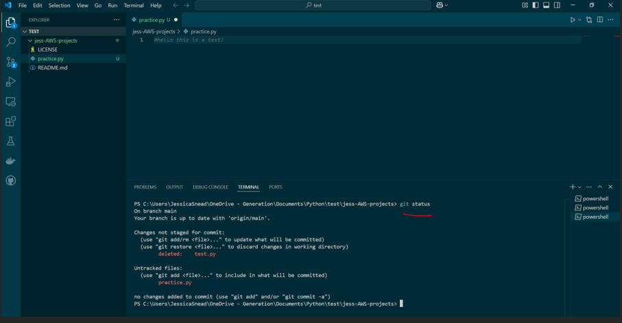

#### `git add .` and `git status`

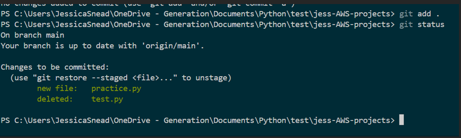

**NOTE:** A rule of thumb when working with a command line, is if nothing shows up after typing in a command then assume it has worked properly! However, in this case you can use `git status` to confirm your `git add .` has worked! 

#### `git commit -m "first message"` and `git status`

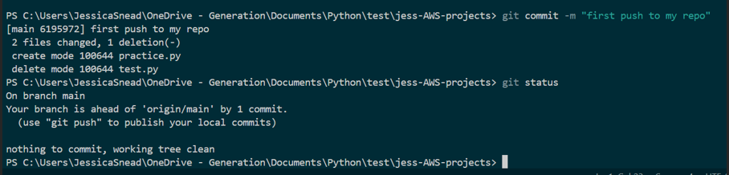

#### `git push`

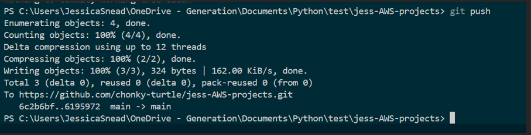

***Well done! Now, go to your repo on Github and you will see your python file stored there.***

**NOTE:** If you do not see it immediately, try refreshing the page! 

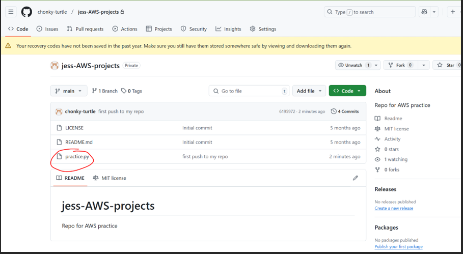

### Well done! You have successfully completed this exercise! :-) 

