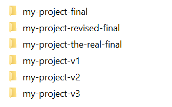
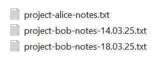
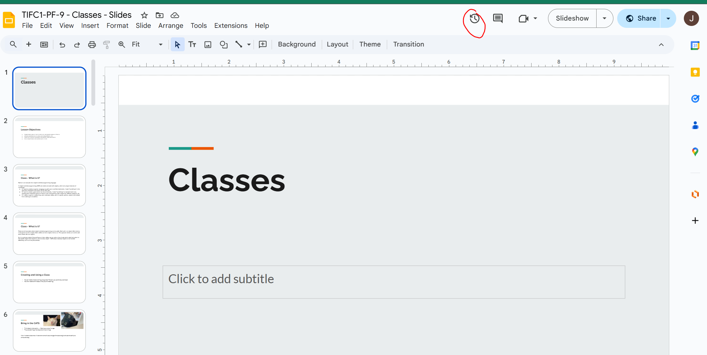
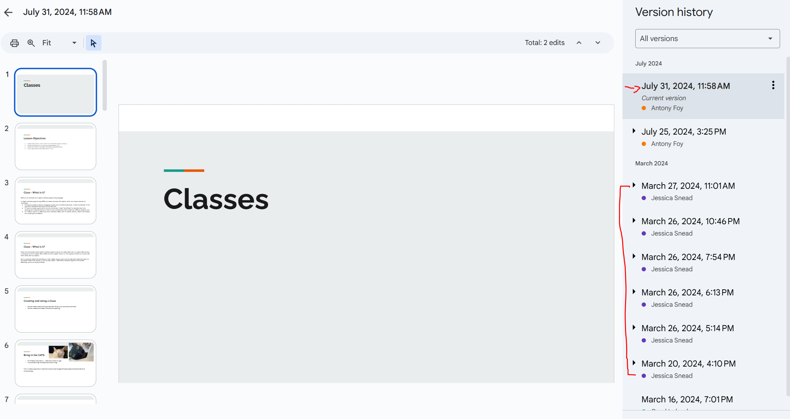
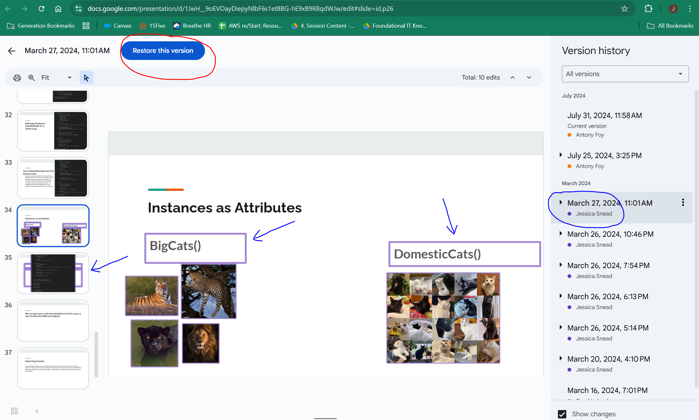
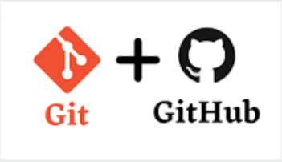
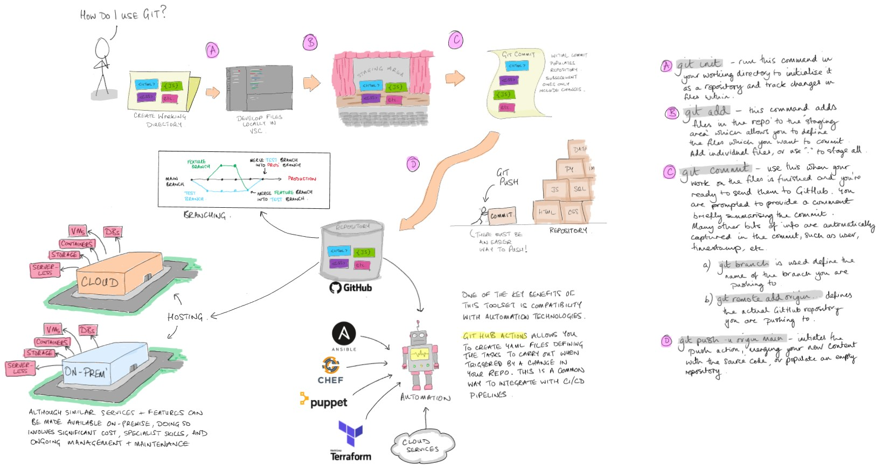

# Introduction to Git and Github

## The Local Approach

Before we dive into Git and GitHub, let’s talk about how we typically manage versions of our work without using version control software.

Imagine you’re developing an app on your computer...

- First you create a folder for the project's files, your `working directory` where you store all the files for your project.
- You will likely be in the habit of implementing version control manually by saving a copy of your work frequently; For example, you might add a new feature, test it, and if successful save it again. If it fails then reload the previous version.

Bad practice can result in messy files & folders, like these mortal sins:

- Copying files into new folders:



- Using dates in filenames:



You start with one version...then make a copy...and another...and before you know it, you’ve got a folder full of files!

- Which one is the latest?  
- What if you need to undo a change?  
- Wait, I've realised I'm down a rabbit hole, I need to go back three steps - which file name was that again?

Have you ever done something like this with a project or an assignment?

It gets messy fast.

### Problems

- As the application and codebase grows, and multiple developers may be working upon it independently, and each saving their own versions locally, then tracking them is difficult.
- If multiple people are editing the same file - whose version is the right one?
- Individual changes may not be brought together for testing the combined functionality very often, therefore when they are, and it inevitably fails, which of all of the new features is causing the bug(s)?

Without a structured way to track and merge updates, finding the source of a problem is like searching for a needle in a haystack!

We need version control!

## The Enterprise Approach

As a solo developer, working on your own computer, you can probably implement a suitable system, as long as you keep it up. But what happens when you're working in an organisation, as part of a team.

This is where version and source control tools become invaluable.

>Be aware that the terms 'source control' and 'version control' are often used interchangeably, however, version control is a general term which can be applied to any collection of files or documents, whereas source control is specifically related to the source code for applications. This means that source control has specialist tools and processes which are very powerful, such as Git, but may not be of any use when it comes to tracking something like evolving legal documents, where 'version control' is what you require.

### Source Control to the Rescue

Source Control is the management and tracking of changes made to files and data, or more specifically, the code and assets which make up our applications and projects. It provides a logical way to record, track, visualize and alter all historic changes made to a document by all contributors.

Source control provides a complete long-term change history of every tracked file.Instead of manually saving multiple local copies, every change is automatically recorded, stored centrally, and can be accessed at any time.

Some more advantages include:

- Allowing teams to work concurrently, even on the same file, with features like `branching` and `merging` used to avoid conflicts.
- The ability to trace each change made to the software, and connect it to project management and bug tracking software tools.
- Clarity for developers, they should easily be able to find and work upon the correct branch of the code.

One more key advantage is the flexibility of source code management systems to inter-connect with other applications and tools, facilitating the automation of processes like testing, staging, and deployment. This is the basis of a **CI/CD Pipeline**.

### Version Control in Action

#### Google Workspace Example

A common example of version control can also be seen with familiar platforms such as Google Workspace.

Often slides or documents will be worked on by multiple people simultaneously, you may have done this already when creating presentations for team work tasks, each person can be making slides or editing at the same time.

- Let's say you're collaborating upon a huge document - such as a service contract, and following a bit of debate you decide a minor change to the working needs to be reverted.
- Maybe you want to see a history of changes to the contract, to identify every stakeholder who edited the document and made those changes?

Google Docs/Slides has a form of version control built-in to help with this.

The image below is of two colleagues working on a presentation, if I wanted to see what was changed last and when you can the *rewind clock* icon.



You'll see a list of versions, who changed the document, what was changed, and the date and time it was changed. You can see that Ant edited the document most recently on `July 31, 2024 at 11:58AM`. Jess last edited the slides on `March 27, 2024 at 11:01AM`.



In addition to these edits, you can also see a history of edits to the slides overtime by all contributors. If you click on a specific entry you will see all of the changes by scrolling through the slides, they'll usually be highlighted in purple.:



If someone is unhappy with an edit, for example Jess is not happy with Ant's edits (because she wants them to include Weasley and Noche, not Frankie and Scout), different versions can be restored by clicking the `Restore this version` button (circled red above).

#### Version Control with Git

The above example is essentially how version control works in Git too. Rather than relying upon manual processes, Git can track and access the different versions, show changes over time, and easily revert to any previous versions if necessary.

When working with code and a new feature causes your code to crash, rather than spending time bug-fixing, you can simply revert back to a new version and restore functionality in seconds.

>..then you identify the person who added the feature, and give them an ear-full for pushing to `production` on a Friday afternoon - **never push to `prod'` on a Friday afternoon!!!**.

Git is the most widely used source control system, and it solves all these problems efficiently.

## Introduction to Git

Now that we understand the importance of source control, let’s get into `Git`.

Git is a source control management system (`SCM`), and it has become a very widely used tool to manage source code. Git has many features, but some of the key ones are:

- Pull working files from a `repository`
- Push the files back to the repository after you have made changes
- Create a local repository from within which the working files can be tracked, staged, and pushed



### What is a Repository?

We've used this term a few times, let's define it before we move on.

A `repository` is simply a container for files and data assets. Strictly speaking a folder on your hard disk is a repository, but when we use this term we typically mean a container with a specific purpose, such as the resources for a particular project.

From a software engineering POV, a repository refers to a location which contains all of the code and assets for a particular application. This type of repository offers functionality to facilitate this purpose, such as access control, automation and API access, remote access, and many others.

A common platform which allows you to make repositories such as this is called GitHub, but many others exist such as BitBucket, GitLab, and Cloud Service Provider (CSP) specific options. If you do not wish to store your code with a 3rd party, you may also host your own repositories on an on-premise server.

### How to Start Using Git

You first need to start with installing Git.

Many (Linux) machines will have this already installed, but you can check by typing `git version` or `git --version` in your `Terminal`.

>Windows includes a couple of CLI interfaces, the oldest one is the Command Prompt or `CMD`, which actually pre-dates Windows. The more modern CLI in Windows is called `PowerShell`. Some functionality is only available in one CLI or the other, but 3rd party tools can often be used from either. In Windows 10 you can open either one individually, but in Windows 11 they're both accessed from within a separate app called `Terminal`

If you do not have Git installed review the following guide for instructions.

[installing-git.md](exercises/installing-git.md)

### Git: A Visual Overview

Now that we’ve learned about how Git helps us track changes, let’s break down some of the key components that make up the Git workflow:

1. Working Directory (Local Environment): This is where you make changes to your code. It refers to the files and folders you’re currently working on.

2. Staging Area (Index): Before committing changes, you add them to the staging area. This is like preparing a draft of changes you’re about to finalize. It's a buffer area between the working directory and the local repository.

3. Local Repository: This is your version of the project stored locally on your machine. After you finalize the changes by committing, they are saved here.

4. Remote Repository (GitHub/Server): This is the repository on GitHub or a remote server. When you "push" your local changes, they are uploaded to the remote repository where others can see or collaborate.(We will discuss this later!)



The above image is a visual way to think about Git. All of the components above connect together to build a Git workflow. Also illustrated are some important commands to keep in mind to allow our changes to be moved from one stage to another.

Some of the key stages in more detail:

#### Working Directory

The working directory is where the magic happens; This is the local environment on your computer, where you actually write and edit your code using your preferred IDE. This is where you make all the changes to your files and folders you are currently working on, but these changes are not yet tracked by Git. You make all of your changes before finalizing them.

>Imagine you're working on a file called `hello-world.txt` in the working directory. You can edit it, save it, or even delete it without Git or your GitHub repository knowing about those changes.  
This is the behaviour we want, because developers may make and undo dozens or hundreds of changes per day as they add and test new functionality. So, we don't want every single change to the file(s) tracked.

#### Staging Area
  
It is likely that not all files in the project have been changed, so this is where the staging area comes in. The files in your project can be tracked and the ones which have been changed are staged with `git add [filename]` (or more commonly `git add .` to track everything).
  
When all of your changes are ready, you can then commit everything in the staging area at once, rather than one file at a time.

Once you've completed all of your updates, you are ready to `commit` the changed files, which is effectively pushing a package containing all of the updates back to the relevant branch.

In addition to the changes, the commit also includes meta-data, some of which is captured automatically, such as a timestamp, and the user's identity. You're also prompted to include a message with your commit which should be a brief summary of what is included.

## Branching

A `branch` is a version of a codebase which is taken from the primary branch at a point in time, and allows a developer to work on new features or bugs, experiment, and collaborate safely, without causing and problems in the production version of the code.

Some common branches include:

|Branch|Description|
|---|---|
|`main`/`master`|The primary, stable version of the code|
|`feature/abc`|A branch for working upon feature 'abc'|
|`bug/xyz`|A branch for working upon bug 'xyz'|
|`dev`|The branch for ongoing development|

>Older projects may still use the name `master` for the primary branch, but typically it is now called `main`.

Some of the common Git CLI commands are shown below, you may also create branches through the web-GUI if using a repository like GitHub.

```bash
git branch            # List branches
git branch new-branch # Create a new branch
git checkout new-branch  # Switch to a branch
git merge new-branch     # Merge changes into current branch
git branch -d new-branch # Delete a branch
```

A typical workflow involves:

1. Start on `main` branch
1. Create a new `feature` or `bug` branch
1. Ensure you are working on the new branch
1. Make changes and `commit` to feature branch
1. Once your feature is complete, and successfully tested, merge the changes from the **feature** branch back to the **main**.

[Click here for a lab on branching from the CLI](exercises/git_branching_lab.md)
