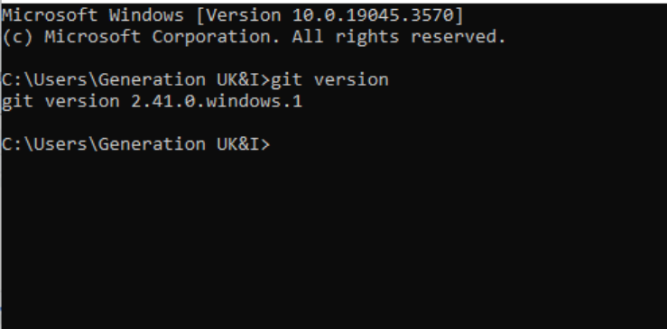

# Installing and Configuring Git & GitHub

Now, let's be clear - Git is a tricky little sucker, even experienced developers have errors and make mistakes - don't believe me? Try Googling [Git memes](https://tinyurl.com/485bdje8)!

There are a couple of different methods for installation.

- **Winget** is a Linux style package manager for Windows. You can use a single `winget` command to install the Git module, and use it through VSC code or the CLI.

- **Dedicated Installer** - download and run the installer* from the GitHub website.

>*This approach will also give you some more utilities such as `Git Bash` which provides a Linux Bash terminal in Windows.

Once installed you can create local repositories, implement version control and branching for your local projects, and more. With some additional configuration, such as authentication, you can commit files to remote repositories to which you have permission.

Before installing check to see if git is already installed by typing `git --version` in your CLI (Powershell, Command Prompt, or Terminal):



If you have an output similar to the above, you have Git installed - don't worry if your version doesn't match the example. If not installed, move to next step - if it is installed you may skip ahead.

## Git Installation

Depending on your operating system, you have different options:

- **Unix based OSes** - use the following command in your Terminal `sudo apt-get install git`

- **MacOS** - you will need the **Homebrew** package manager first, verify this with `which brew` or `brew help`. If they return an error, find instructions to [install it here](https://brew.sh/).

  With Homebrew installed use the following command in your MacOS Terminal `brew install git`

- **Windows**
  - **Winget** Type the following command into Windows PowerShell `winget install --id Git.Git -e --source winget`
  - The more comprehensive approach is to download the official installer from the [GitHub website](https://git-scm.com/downloads).
  
Once installed type `git --version` or `git version` in your Terminal to confirm it returns a version number.

>NOTE: You might need to restart your device if you do not get the expected output from `git --version`. You may also need to close Visual Studio Code and reopen it.

*If all you need to do is clone repositories, then you can stop here. For example, if you just need a copy of some resources and you don't intend to commit back to a branch. However, if you need to work with a repository in GitHub we need to do some additional configuration.*

### Git Configuration

Now you need a GitHub account, [create one here](https://github.com/signup). Use a personal email address so that you don't lose access to it after your Generation program.

Next you need to configure Git on your computer, run the following commands one by one within your terminal, the credentials you use should match the ones you used for your GitHub account.

```bash
git config --global user.name "[yourName]"
git config --global user.email "[yourEmail]"
git config --global init.defaultBranch main
git config --global core.pager cat
git config --global core.editor "nano"
git config --global pull.rebase false
git config --global fetch.prune true
```

These commands are setting up Git so it knows who you are and how you want it to behave. Here is a description of what each line is doing:

|Command|Description|
|---|---|
|`git config --global user.name "Your Name"`|Is telling Git your name so you can label your work.|
|`git config --global user.email "[yourEmail]"`|Tells Git your email, which also goes on your commits.|
|`git config --global init.defaultBranch main`|Sets `main` as the name for the first branch whenever you start a new project|
|`git config --global core.pager cat`|Makes Git show full command results right away, without pausing.|
|`git config --global core.editor "nano"`|Sets nano as the editor Git will use when you need to type a message (like commenting on your commits).|
|`git config --global pull.rebase false`|When you update your project from GitHub, this tells Git to merge changes instead of trying to re-organize them.|
|`git config --global fetch.prune true`|Cleans up old branch references when you're syncing with GitHub, so your list stays tidy.|

Some of this may not make sense for the moment, however you will likely be using Github a lot in future, so this will become more clear with practice.

### Additional Config Commands

- If you want to confirm or verify the settings you've applied, you can use the following command: `git config --list` This will display a list of all the current Git configuration settings.
- If you want to confirm a specific setting Git is currently using, you can use: `git config --get user.name` This specific command will just show you the configured username. You can replace `user.name` with any other configuration key to get the respective value.
- If you need to change a setting in your Git configuration, you can simply run the `git config` command again with the updated value.

## Authenticating with GitHub

To use Git with GitHub we need to authenticate your local machine.

Although you can clone public repo’s without authenticating, to push to your own repositories (or others you've been given permission for) you need to generate some ssh keys.

### Git Bash or Linux

1. In Git Bash generate an ssh key pair by adding your github email address to the following command:

```bash
ssh-keygen -t ed25519 -C "[your github email]”
```

2. You will be asked where to save the key, press `enter` to save in the default location which is a hidden `.ssh` folder in your home directory. Note the key name. You will also be prompted to enter a passphrase to secure the key, but leave it blank on this occasion.

3. You now need to add the new key to both the ssh-agent on your computer, and to GitHub so that it trusts your pushes. In Git Bash start the ssh-agent typing 

```bash
eval "$(ssh-agent -s)"
```

You should receive a process ID (pid)

4. If you view the file location you should see that two keys have been generated, a public ending in `.pub`, and a private. Add your new private key to the ssh agent with 

```bash
ssh-add ~/.ssh/[keyname]
```

Your public key can be used to verify messages sent with your private key, to facilitate this you need to add your public key to GitHub, therefore when you send data encrypted with the private key, it mathematically verifies your identify.

5. View the public key using cat or a text editor, and copy the contents to your clipboard.

6. In GitHub navigate to your profile, and find the `SSH and GPG keys` section.
Select `Add a new SSH Key`, and paste the public key into the text box, then click `Add Key`.

### PowerShell

If you do not have Git Bash you can use PowerShell:

1. Generate an ssh key pair by adding your github email address to the following command:

```powershell
ssh-keygen -t ed25519 -C "[your github email]”
```

2. You will be asked where to save the key, press `enter` to save in the default location which is a hidden `.ssh` folder in your home directory. Note the key name. You will also be prompted to enter a passphrase to secure the key, but leave it blank on this occasion.

3. Start the SSH Agent with

```powershell
Start-Service ssh-agent
```

Confirm with

```powershell
Get-Service ssh-agent
```

4. Add Your Private Key to the Agent

```powershell
ssh-add $env:USERPROFILE\.ssh\id_ed25519
```

5. View the public key using a text editor, and copy the contents to your clipboard.

6. In GitHub navigate to your profile, and find the `SSH and GPG keys` section.
Select `Add a new SSH Key`, and paste the public key into the text box, then click `Add Key`.

## Creating a Local Repository

Now you can start working from scratch by creating a new repository, or you can clone an existing one.

To convert a local working directory into a repository, navigate to the directory in your CLI and type `git init`. You may convert an existing directory, or create a new one.

Confirm the repository has been created by checking for the hidden .git directory. Use `rm -rf .git` (i.e. delete the hidden `git` directory) to revert back to normal.

## Pushing to GitHub

Now you have:

- Git installed
- Git configured
- Git Authenticated
- A local repository with some code and/or data files

You can now use `git commit` and `git push` to syncronise your local repository with GitHub. You will be prompted to provide a commit message, your first commit when you're populating your repo' is often just *"initial commit"*.

## Easy Mode

If you've gotten this far congrats... now for easy mode.

If you have git and `Visual Studio Code` installed, you can actually do everything from within VSC.

>Why not do it this way from the start??? [Don't forget](https://blog.codeitbro.com/wp-content/uploads/2025/08/using-git-via-gui-vs-command-line-meme.jpg)
